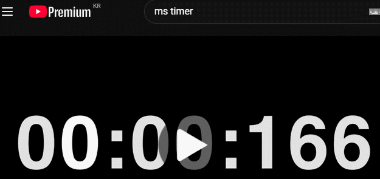

# youtube-speed-controller

### 유튜브 재생속도 조절을 키 딸깍 한 번으로 편하게!

### [크롬 웹 스토어에서 보기](https://chromewebstore.google.com/detail/youtube-speed-controller/ojgkfaimmmkolonodkafbjkdiedalgap)

## Tech Stack
- Typescript

## Core Features

모든 유튜브 영상이 우리에게 도움이 되지는 않습니다. 또한 모든 도움이 되는 영상이 우리의 템포와 맞지도 않습니다.  

이 확장앱은 유튜브를 볼 때, 원하는 구간을 원하는 속도로 편하게 훑기 위해 만들어졌습니다.  
더 이상 방향키로 영상을 넘겼더니 자막도 훌쩍 뛰어넘어버려서 다시 돌아오는 행동을 하지 않으셔도 됩니다.

### 재생 속도 전환

미리 배속을 할당한 키를 누르면 즉시 재생 속도가 변경됩니다. 

### 재생 속도 토글

키를 누르고 있는 동안만 특정 속도로 재생합니다. 기본 재생 속도를 빠르게 둔 뒤 토글 재생 속도를 천천히 하는 방식 등의 응용도 가능합니다.

### 키 커스터마이즈

다음 버전은 미리 정해진 속도에 키를 매핑하는 대신에,  
동작(전환/토글), 속도, 키를 입력받아 개별 항목을 추가하고 삭제하는 식으로 구현하려 합니다.
